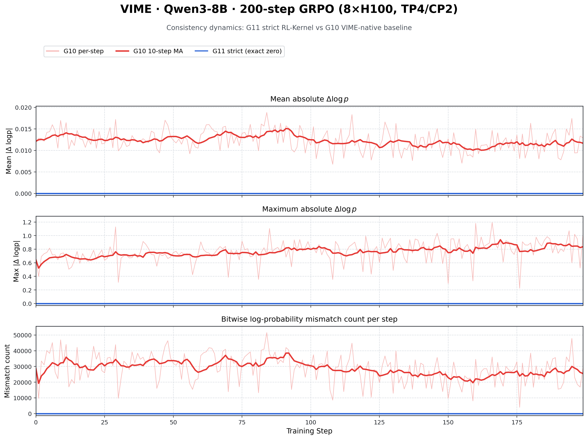
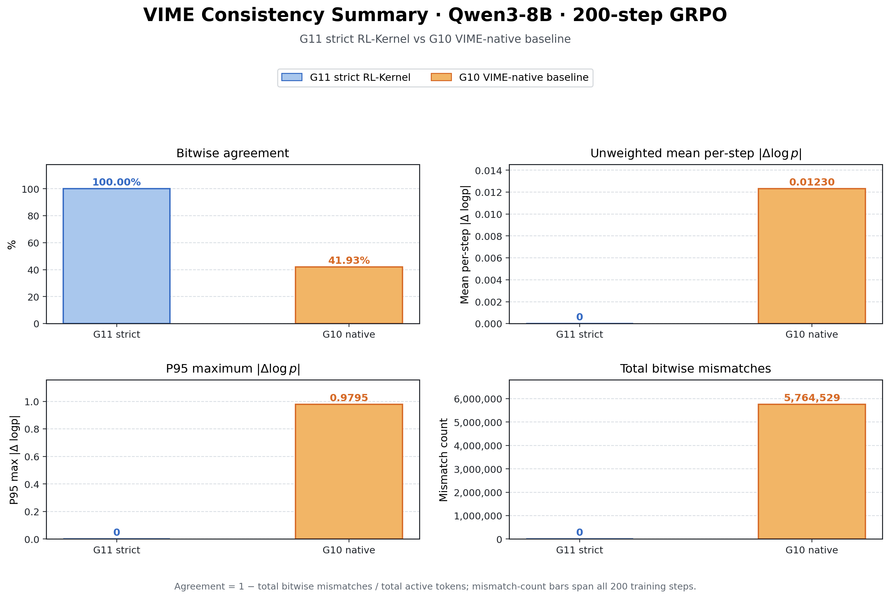
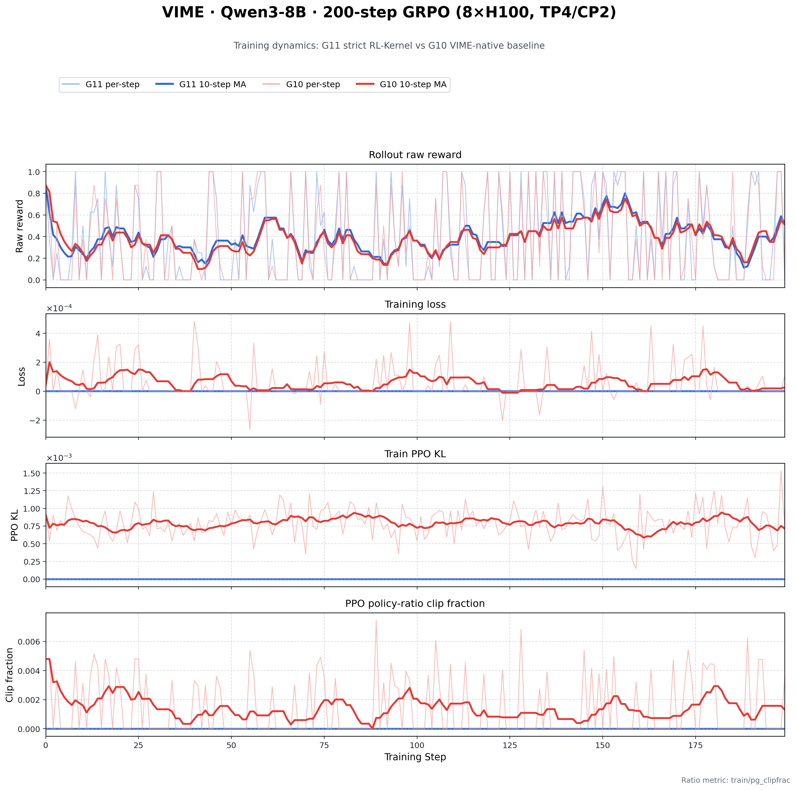

# G10/G11 200-step convergence results

This directory publishes the completed half of the Qwen3-8B TP4/CP2
consistency matrix. It contains one sealed 200-step run for G10 and one for
G11. G00 and G01 were paused and are intentionally not represented here, so
these artifacts must not be interpreted as a completed four-arm ablation.

## Result

Both runs used one 8xH100 node, a TP4/CP2 Megatron actor, two colocated TP4
vLLM engines, seed 1234, eight samples per prompt, and the same DAPO-Math-17k
data hash. Both validators passed the `FULL_DECODE_ONLY` CUDA Graph contract
with capture sizes 1 through 8 and found no fallback or runtime-route error.

| Group | Runtime route | Active tokens | Bitwise mismatches | Mismatch rate | Token-weighted mean abs dlogp | Max abs dlogp | Mean raw reward |
|---|---|---:|---:|---:|---:|---:|---:|
| G11 | strict RL-Kernel R/R | 9,806,995 | 0 | 0 | 0 | 0 | 0.3950 |
| G10 | VIME-native P/P baseline | 9,927,045 | 5,764,529 | 58.0689% | 0.012567 | 1.191781 | 0.3794 |

G11 therefore satisfies the strongest claim supported by this experiment:
zero runtime bitwise train/rollout log-probability mismatches over 9.81 million
active tokens. G10 is the native production comparison, not a failure gate;
its nonzero drift measures the train/rollout numerical gap of that route.
The result table reports a token-weighted mean absolute difference, while the
summary figure labels its separate unweighted mean across the 200 step means.

The raw-reward curves are close because both runs start from the same model,
prompt order, sampling seed, reward function, and rollout topology. Reward is
an outcome-level, relatively coarse metric; it is much less sensitive than the
token-level log-probability comparison. With one seed, the small reward-mean
difference is descriptive rather than a statistical quality claim.

## Figures







The trajectory figure compares per-step mismatch counts directly. The summary
figure reports the cumulative comparison: 0 mismatches for G11 strict
RL-Kernel versus 5,764,529 for the G10 VIME-native baseline.

The near-zero G11 scalar training loss and PPO KL do not mean that gradients
were absent. With rollout log-probability reuse, the pre-update policy ratio is
exactly one; GRPO group-centers advantages, so positive and negative terms can
cancel in the reported scalar while their parameter derivatives remain
nonzero. The plotted PPO KL is the old/rollout-policy diagnostic, not KL to a
reference model.

Neither run activated a reference model: `kl_coef=0`, `use_kl_loss=false`, and
`kl_loss_coef=0`. A `ref_load` path was recorded, but VIME does not load the
reference checkpoint under those settings. This is intentional for the
train/rollout consistency study and keeps reference regularization from
changing its objective.

## Provenance and limitations

| Group | Run ID | RL-Kernel | VIME | Megatron | Transformer Engine |
|---|---|---|---|---|---|
| G11 | `g11-convergence-s1234-tp4-20260901e` | `5403df6` | `a013293` | `1dcf0da` | 2.11 |
| G10 | `g10-convergence-s1234-tp4-20260901j` | `d2173e8` | `1a113710` | `1dcf0da` | 2.18 |

The G11 run is the immutable sealed run selected by the experiment protocol.
The later G10 run includes production-route verification and CUDA Graph/provider
decoupling fixes. Because the repository revisions and Transformer Engine
versions differ, these two artifacts establish route-specific consistency but
are not used for a performance comparison. No performance figure is published.

Stopped G10h and G10i attempts are audit-only and excluded. Offline tensor
comparison is unavailable because the VIME debug dump did not capture training
`log_probs`; the accepted consistency evidence is VIME's runtime `torch.ne`,
maximum, and mean absolute-difference instrumentation recorded by the sealed
validator.

## Artifacts

- `runs.csv`: run identities, revisions, hashes, and validation status.
- `rounds.csv`: 400 per-step records (200 each for G10 and G11).
- `summary.csv` and `summary.json`: machine-readable aggregate results.
- `plot_report.py`: reproduces the three PNG/PDF figures from `rounds.csv`.
- `figures/`: publication-ready PNG and PDF outputs.

Regenerate the figures from this directory with:

```bash
python3 plot_report.py --rounds-csv rounds.csv --output-dir figures
```

The plotting command requires Matplotlib; the CSV/JSON artifacts themselves
use only standard text formats.
